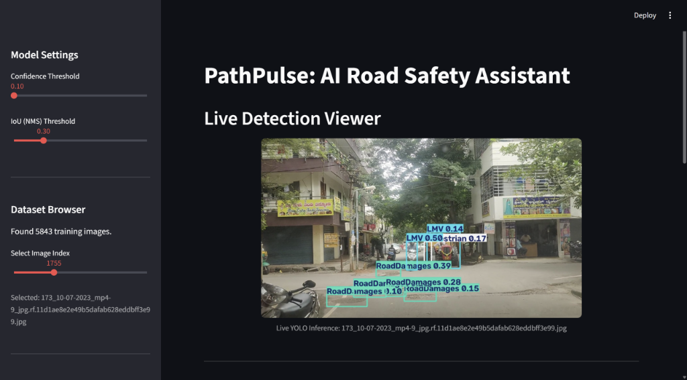
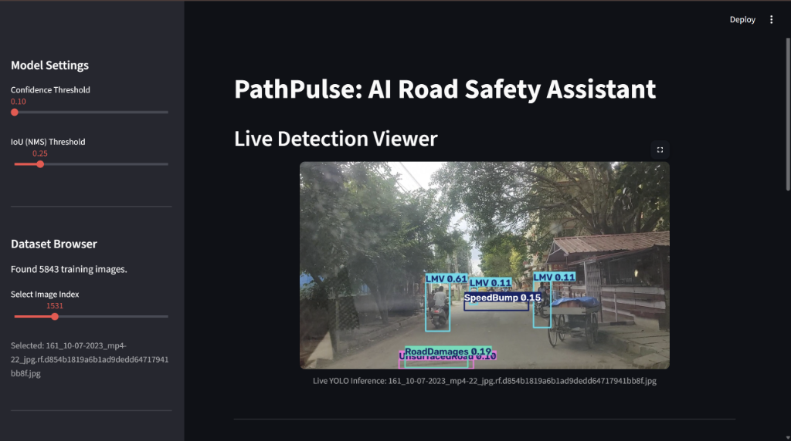
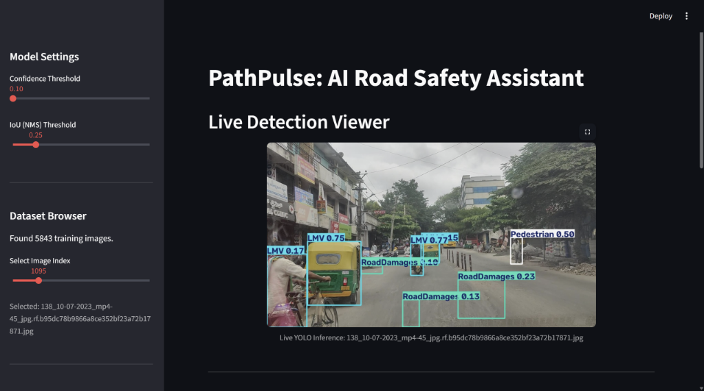

# PathPulse: AI-Powered Road Infrastructure Intelligence

**[View the Official PathPulse Pitch Deck (PDF)](./PathPulse_PitchDeck.pdf)**

**Team:** MindSpark *(We are a team of 1st-Year Students!)* 🎓  
**Event:** Exasol AI Build Challenge 2026 (ChennAI Summit)

### Live Detection Viewer

<br>

<br>


---

## The Problem - Blind Spots in Civic Infrastructure

*   **Manual & Slow:** City governments currently rely on manual citizen reports or slow, expensive manual surveying to find road damages.
*   **Reactive, not Proactive:** By the time a pothole is reported, it has already caused vehicle damage or traffic congestion.
*   **Data Silos:** Incident reports are scattered across emails, phone calls, and outdated databases, making it impossible to analyze city-wide trends.

---

## The Solution - PathPulse

PathPulse is an end-to-end computer vision and analytics pipeline that automates road safety monitoring.

*   **Data Source:** Trained on the **[RAD (Road Anomaly Detection) Dataset from Kaggle](https://www.kaggle.com/datasets/rohitsuresh15/radroad-anomaly-detection)** to detect real-world infrastructure hazards.
*   **Automated Detection:** Feed dashcam or traffic camera footage directly into our AI to instantly identify road hazards.
*   **Actionable Intelligence:** We don't just detect potholes; we categorize them, score their severity, and log them into an enterprise analytics database.
*   **Live Command Center:** A real-time dashboard for city planners to see exactly where infrastructure is failing.

---

## How It Works (The Tech Stack) - A Modern, Enterprise-Grade Pipeline

*   **The Brain (Ultralytics YOLOv8):** We trained a custom computer vision model on a Kaggle dataset to detect 6 specific classes (Heavy Vehicles, Light Vehicles, Pedestrians, Road Damages, Speed Bumps, Unsurfaced Roads).
*   **The Memory (Exasol):** The AI's telemetry is streamed live into a local Dockerized **Exasol** database, chosen for its ultra-fast, in-memory analytical processing.
*   **The Face (Streamlit):** An interactive Python frontend that allows operators to dynamically adjust AI confidence thresholds and view live database metrics.

---

## Deep Dive: Powering Analytics with Exasol

**👉 [Read our full technical whitepaper: Powering PathPulse with Exasol](./EXASOL_INTEGRATION.md)**

Because this project was built for the **Exasol AI Build Challenge**, we specifically engineered our data pipeline to take advantage of Exasol's unique high-performance architecture. Here is how Exasol made PathPulse possible:

*   **Zero-Latency In-Memory Processing:** Computer vision inference generates thousands of data points a minute. Exasol’s in-memory database architecture ensures that reading the live severity metrics into Streamlit charts happens instantaneously without locking up the UI.
*   **The `pyexasol` Driver:** Instead of using slow, standard ORMs (like SQLAlchemy), we leveraged the optimized `pyexasol` WebSocket driver. This allowed us to execute raw, high-throughput SQL statements (`INSERT INTO CIVIC.ROAD_INCIDENTS ...`) directly from the Python inference loop.
*   **Edge-Ready Footprint (`exasol-nano`):** We utilized the localized `exasol-nano` Docker container. This proves that our infrastructure can run in a true edge-computing environment (such as an onboard computer inside a city maintenance vehicle) without requiring a massive cloud footprint or constant internet connectivity.

---

## Overcoming Technical Hurdles - Hackathon Engineering

*   **Data Balancing:** The original dataset was heavily skewed. We wrote a custom Python script to dynamically downsample the data, preventing the AI from being biased toward common objects (cars) over rare ones (potholes).
*   **Speed vs. Accuracy:** We utilized YOLOv8 Nano and trained it for more than 40 epochs—finding the perfect sweet spot between lightweight, real-time inference speed and detection accuracy.
*   **Database Bypassing:** We bypassed standard ORM bottlenecks by writing raw batch-insertion SQL queries directly to the Exasol backend to ensure the dashboard never lags.
*   **Edge-Computing Architecture (First-Year Initiative):** As 1st-year students, we wanted to push our limits. Instead of a standard cloud deployment, we intentionally deployed our Exasol analytics database inside a **local Docker container**. This mimics a true "edge-computing" environment (like an onboard computer in a garbage truck), ensuring zero-latency data processing and maximum data privacy without relying on internet connectivity!

---

## Real-World Impact - Smarter Cities, Safer Roads

*   **Cost Reduction:** Eliminates the need for manual road surveying fleets.
*   **Resource Allocation:** Exasol's analytics allow city planners to deploy repair crews based on data-driven severity heatmaps rather than guessing.
*   **Scalability:** The pipeline is lightweight enough to be deployed on edge devices (like garbage trucks or buses) to continuously scan the city every single day.

---

## What's Next? (Future Roadmap)

*   **Geospatial Mapping:** Integrating GPS data to plot detected potholes on a live interactive map.
*   **Cloud Migration:** Moving our local Exasol Docker instance to AWS for centralized, multi-city data syncing.
*   **Automated Work Orders:** Triggering an API to automatically dispatch repair crews when a `RoadDamage` severity hits Level 5.

---

## How to Run Locally

If you want to spin this up on your own machine, you'll need the `exasol-nano` Docker container running on port `8563`.

**1. Start the Database:**
```bash
docker run -p 8563:8563 exasol/exasol-nano
```

**2. Install the Requirements:**
```bash
pip install streamlit ultralytics pyexasol pandas pillow
```

**3. Launch the Dashboard!**
```bash
python -m streamlit run app.py
```
